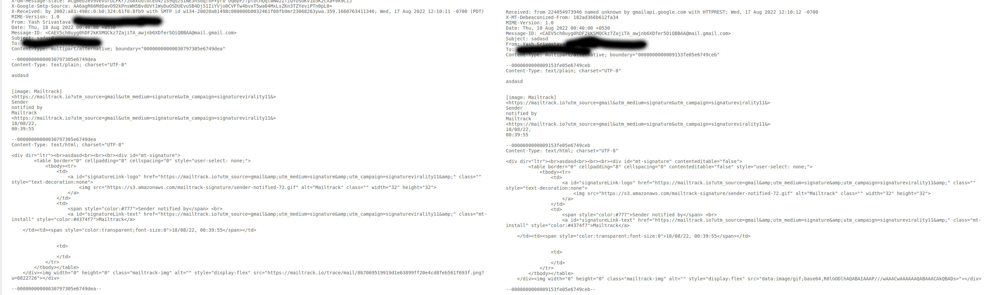

# Something is fishy with mailtrack!

So it began when I was trying to add mailtrack for tracking whether my email is opened or not. While installing I found out that it requires <b>Read, compose, send and permanently delete all your email from Gmail</b> which is a really big deal as can be seen below.

<!-- Import image -->

# What I did then?

I installed mailtrack with a dummy account of mine. After this I tried sending an email to myself to check how it really works. I found out that it detects count of emails if someone tries to open email from inbox but it doesn't detect if someone tries to open email his sent email, which is obviously the intended behaviour.

I initially thought it would attach a fake image tag with an API call to it's server and then later increase it's count. But if only this is happening then If I view the email from sent mails It should be detected as opened. So how is it really working?

# Comparing eml files for mails in Sent and Inbox

I basically compared the eml files for mails in Sent and Inbox and found out that they are different. The one in Inbox of the recieved user is through SMTP and the one in Sent is through IMAP with REST API call to the server. One more difference is that the one in Sent does not contain the image tag with tracking code but the one in Inbox does.

# So finally, How does it work?

I instantly went to [Gmail.js](https://github.com/KartikTalwar/gmail.js/) and [google-api-client](https://github.com/googleapis/google-api-nodejs-client/) and deep-dive into the code.

I found out with Gmail.js we can edit the dom and add a tag with tracking code to the email and later send it. This way the recipient can see the email as opened with tracking code. Google API Client is can be used to first authorize the user with the `mailtrack's` <b>Read, compose, send and permanently delete all your email from Gmail</b> permission. and after the mail is sent either we can run a cron job or subscribe to an event that triggers when the mail is sent. Later we can copy the raw email in sent box, edit the tracking code, send it again using IMAP append or [messages.insert](https://developers.google.com/gmail/api/reference/rest/v1/users.messages/insert) so that mail is not sent to recipient but just added to sent box and later delete the previous sent mail **Hooray!**

# Next Steps?

Obviously I would not like to give my gmail account permission to someone. So thought why not create one by myself and use it to send and track emails!

# Tech Stack

- [Gmail.js](https://github.com/KartikTalwar/gmail.js/) for manipulating the dom and adding tracking code to the email.
- [google-api-client](https://github.com/googleapis/google-api-nodejs-client/) for oauth and IMAP append.
- [prisma](https://www.prisma.io/) for ORM.
- [express](https://expressjs.com/) for server.
- [GmailJS Node boilerplate](https://github.com/josteink/gmailjs-node-boilerplate) for chrome extension boilerplate.

# Contributing

The code is open source and you can contribute to it by creating an issue or a pull request. The [Github repository](https://github.com/darkshredder/mail-tracker) is the place to go to.
